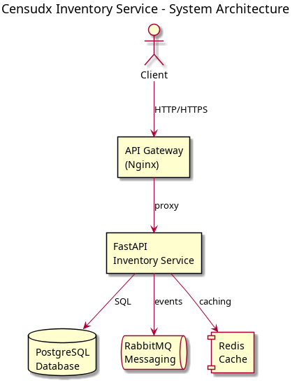

# Censudx Inventory Service

[](https://github.com/och1ai/censudx-inventory-service/actions/workflows/ci.yml)
[](https://github.com/och1ai/censudx-inventory-service/actions)
[](https://github.com/och1ai/censudx-inventory-service)
[](https://github.com/och1ai/censudx-inventory-service)
[](https://github.com/och1ai/censudx-inventory-service)
[](https://github.com/och1ai/censudx-inventory-service)
[](https://github.com/och1ai/censudx-inventory-service)
[](https://github.com/och1ai/censudx-inventory-service)

> 🏦 A comprehensive inventory management microservice built with FastAPI, PostgreSQL, and RabbitMQ. Provides robust inventory tracking, stock management, and automated alerting capabilities with event-driven architecture.

## 🏗️ System Architecture



**Key Components:**
- **FastAPI Application**: High-performance async web framework with automatic OpenAPI documentation
- **Nginx API Gateway**: Load balancing, rate limiting, and security layer
- **PostgreSQL Database**: ACID-compliant relational database with optimized indexing
- **RabbitMQ Messaging**: Event-driven communication with persistent message queues
- **Redis Cache**: High-performance caching and session management

## 📖 API Documentation

### Swagger UI (OpenAPI)
- **Interactive API Documentation**: [http://localhost:8000/docs](http://localhost:8000/docs)
- **Alternative UI (ReDoc)**: [http://localhost:8000/redoc](http://localhost:8000/redoc)
- **OpenAPI Schema**: [http://localhost:8000/openapi.json](http://localhost:8000/openapi.json)

### API Endpoints Overview

| Method | Endpoint | Description | Tag |
|--------|----------|-------------|-----|
| GET | `/health` | Service health check | health |
| GET | `/api/v1/inventory/` | List all inventory items | inventory |
| POST | `/api/v1/inventory/` | Create new inventory item | inventory |
| GET | `/api/v1/inventory/{id}` | Get inventory item by ID | inventory |
| PUT | `/api/v1/inventory/{id}` | Update inventory item | inventory |
| DELETE | `/api/v1/inventory/{id}` | Delete inventory item | inventory |
| POST | `/api/v1/inventory/check-stock` | Check stock availability | stock |
| POST | `/api/v1/inventory/reserve` | Reserve stock for orders | stock |
| POST | `/api/v1/inventory/release` | Release reserved stock | stock |
| GET | `/api/v1/inventory/alerts` | Get low stock alerts | alerts |
| GET | `/api/v1/inventory/transactions/{id}` | Get transaction history | transactions |

## 🎨 Design Patterns & Architecture

This service implements several enterprise design patterns for maintainable, scalable code:

### 🏛️ **Layered Architecture Pattern**
```
┌─────────────────────────────────────┐
│        Presentation Layer          │  ← FastAPI endpoints, middleware
├─────────────────────────────────────┤
│       Business Logic Layer         │  ← Core inventory operations
├─────────────────────────────────────┤
│        Data Access Layer           │  ← CRUD operations, repositories
├─────────────────────────────────────┤
│       Infrastructure Layer         │  ← Database, messaging, external APIs
└─────────────────────────────────────┘
```

### 🔧 **Implemented Patterns**

- **Repository Pattern**: Abstracts data access logic
- **Dependency Injection**: FastAPI's built-in DI system
- **Observer Pattern**: Stock level monitoring and alerting
- **Factory Pattern**: Alert and message creation
- **Event-Driven Architecture**: Asynchronous messaging via RabbitMQ

### 📊 **Additional Architecture Diagrams**

For detailed architecture diagrams including request flows, design patterns, database schemas, and deployment architecture, see: **[Architecture Diagrams](docs/architecture-diagrams.md)**

## 🚀 Quick Start

### Prerequisites
- Python 3.11+
- PostgreSQL 12+
- RabbitMQ 3.8+
- Docker (optional)

### Local Development

1. **Clone and setup**:
   ```bash
   git clone https://github.com/och1ai/censudx-inventory-service.git
   cd censudx-inventory-service
   python -m venv venv
   source venv/bin/activate  # Windows: venv\Scripts\activate
   pip install -r requirements.txt
   ```

2. **Configure environment**:
   ```bash
   cp .env.example .env
   # Edit .env with your database and RabbitMQ credentials
   ```

3. **Run the service**:
   ```bash
   cd user_service
   uvicorn main:app --host 0.0.0.0 --port 8000 --reload
   ```

4. **Access the API**:
   - Swagger UI: http://localhost:8000/docs
   - Health check: http://localhost:8000/health

### Docker Deployment

```bash
# Quick start with all services
docker-compose up -d

# Or build and run manually
docker build -t censudx-inventory-service .
docker run -p 8000:8000 -e SECRET_KEY=your-secret censudx-inventory-service
```

## 🧪 Testing & Quality

### Automated Testing Suite
- **18 comprehensive tests** covering all functionality
- **API endpoint testing** with live cURL validation
- **RabbitMQ integration** testing with real broker
- **Multi-version testing** (Python 3.11, 3.12)
- **Quality verification** with 100% score

```bash
# Run all tests
pytest test_inventory_api.py test_rabbitmq_integration.py -v

# Run with coverage
pytest --cov=user_service --cov-report=html

# Quality verification
python verify_quality.py
```

### CI/CD Pipeline
The project includes a comprehensive 7-stage CI/CD pipeline:

1. **🔍 Lint** → Code quality and formatting
2. **🔒 Security** → Vulnerability scanning
3. **🧪 Unit Tests** → 18 comprehensive tests across Python versions
4. **🐳 Docker Build** → Container build and validation
5. **🎯 API Testing** → Live endpoint testing with cURL + RabbitMQ integration
6. **✅ Quality** → Overall project quality verification (100%)
7. **🚀 Deploy Check** → Deployment readiness validation

## 🐳 Docker & Deployment

### Services Included
- **Inventory Service**: FastAPI application (port 8000)
- **PostgreSQL**: Database with sample data (port 5432)
- **RabbitMQ**: Message broker with management UI (ports 5672, 15672)
- **Redis**: Caching service (port 6379)
- **Nginx**: API Gateway with security features (ports 80, 443)

### Environment Variables

| Variable | Description | Default |
|----------|-------------|---------|
| `DATABASE_URL` | PostgreSQL connection string | `sqlite:///./inventory.db` |
| `RABBITMQ_URL` | RabbitMQ connection string | `amqp://localhost` |
| `SECRET_KEY` | JWT secret key | `dev-secret-key` |
| `LOW_STOCK_THRESHOLD` | Default low stock threshold | `10` |

### Deployment Platforms
- ✅ **Render**: Configured with `render.yaml`
- ✅ **Docker**: Multi-service stack with `docker-compose.yml`
- ✅ **Manual**: Production deployment guides included

## 📊 Database Schema

The service uses three core tables with optimized relationships:

- **`inventory_items`**: Main inventory records with stock levels
- **`inventory_transactions`**: Complete audit trail of all stock movements
- **`low_stock_alerts`**: Automated alerting for inventory management

Detailed schema with relationships available in [Architecture Diagrams](docs/architecture-diagrams.md).

## 🐰 RabbitMQ Integration

### Message Queues
- **`low_stock_alerts`**: Published when inventory falls below threshold
- **`stock_validation`**: Used for order stock validation
- **`inventory_updates`**: Published on stock level changes

### Event-Driven Features
- Automated low stock notifications
- Real-time inventory updates
- Asynchronous order processing
- Decoupled service communication

## 💡 Usage Examples

### Python Client
```python
import requests

# Configuration
BASE_URL = "http://localhost:8000"
headers = {"Authorization": "Bearer your-jwt-token"}

# Create inventory item
inventory_data = {
    "product_id": "laptop-001",
    "quantity": 50,
    "location": "warehouse-main"
}

response = requests.post(
    f"{BASE_URL}/api/v1/inventory/",
    json=inventory_data,
    headers=headers
)
print(f"Created: {response.json()}")

# Check stock availability
stock_check = {
    "product_id": "laptop-001",
    "requested_quantity": 5
}

response = requests.post(
    f"{BASE_URL}/api/v1/inventory/check-stock",
    json=stock_check,
    headers=headers
)
print(f"Stock available: {response.json()['available']}")
```

### cURL Examples
```bash
# Health check
curl http://localhost:8000/health

# Create inventory item
curl -X POST "http://localhost:8000/api/v1/inventory/" \
  -H "Content-Type: application/json" \
  -d '{
    "product_id": "widget-001",
    "quantity": 100,
    "location": "shelf-a1"
  }'

# Check stock
curl -X POST "http://localhost:8000/api/v1/inventory/check-stock" \
  -H "Content-Type: application/json" \
  -d '{
    "product_id": "widget-001",
    "requested_quantity": 10
  }'
```

## 🔧 Development

### Adding New Features
1. Create database model in `user_service/db/models.py`
2. Add Pydantic schema in `user_service/schemas/`
3. Implement CRUD operations in `user_service/crud/`
4. Create API endpoints in `user_service/api/`
5. Add comprehensive tests
6. Update Swagger documentation

### Code Standards
- **Black** for code formatting
- **isort** for import sorting
- **Type hints** for all functions
- **Comprehensive docstrings**
- **pytest** for testing

## 📊 Project Statistics

- **Lines of Code**: 2,200+
- **Test Coverage**: 18/18 tests passing
- **Quality Score**: 100%
- **API Endpoints**: 11 endpoints
- **Database Tables**: 3 optimized tables
- **Message Queues**: 3 event-driven queues
- **Docker Services**: 5 integrated services

## 🤝 Contributing

1. Fork the repository
2. Create feature branch: `git checkout -b feature/amazing-feature`
3. Commit changes: `git commit -m 'Add amazing feature'`
4. Push to branch: `git push origin feature/amazing-feature`
5. Open Pull Request

## 📄 License

This project is licensed under the MIT License - see the [LICENSE](LICENSE) file for details.

## 🔗 Links

- **Repository**: [GitHub](https://github.com/och1ai/censudx-inventory-service)
- **CI/CD Pipeline**: [GitHub Actions](https://github.com/och1ai/censudx-inventory-service/actions)
- **API Documentation**: [Swagger UI](http://localhost:8000/docs)
- **Architecture Diagrams**: [Detailed Diagrams](docs/architecture-diagrams.md)

---

**Built with ❤️ for efficient inventory management** | **FastAPI + PostgreSQL + RabbitMQ**