# 🏗️ Censudx Inventory Service - Architecture Diagrams

## 📊 System Architecture Overview

```plantuml
@startuml system-architecture
!theme plain
skinparam backgroundColor #FFFFFF
skinparam handwritten false
skinparam shadowing false

title Censudx Inventory Service - System Architecture

actor "Client" as client
rectangle "API Gateway (Nginx)" as gateway {
  note right : Load Balancing\nRate Limiting\nSecurity Headers\nCORS
}

rectangle "Inventory Service" as service {
  component "FastAPI Application" as api
  component "Authentication Middleware" as auth
  component "Business Logic Layer" as logic
  component "Data Access Layer (CRUD)" as dal
  
  api --> auth : validates
  auth --> logic : processes
  logic --> dal : accesses
}

database "PostgreSQL" as db {
  entity "inventory_items" as items
  entity "inventory_transactions" as transactions  
  entity "low_stock_alerts" as alerts
}

queue "RabbitMQ" as mq {
  queue "low_stock_alerts" as lsa_queue
  queue "stock_validation" as sv_queue
  queue "inventory_updates" as iu_queue
}

cache "Redis Cache" as cache {
  note right : Session Storage\nQuery Caching\nRate Limiting
}

cloud "External Services" as external {
  service "Auth Service" as auth_svc
  service "Product Service" as prod_svc
}

' Connections
client --> gateway : HTTP/HTTPS
gateway --> api : proxies to
dal --> db : SQL queries
logic --> mq : publishes events
service --> cache : caches data
service --> external : integrates with

' Data relationships
items ||--o{ transactions : has many
items ||--o{ alerts : generates

@enduml
```

## 🔄 Request Flow Diagram


## 🏛️ Layered Architecture Pattern


## 🎯 Design Patterns Implementation


## 🔌 Event-Driven Architecture


## 🗄️ Database Schema Diagram

```plantuml
@startuml database-schema
!theme plain
skinparam backgroundColor #FFFFFF

title Database Schema - Entity Relationship Diagram

entity "inventory_items" {
  * **id** : SERIAL (PK)
  --
  * product_id : VARCHAR(255) UNIQUE
  * quantity : INTEGER ≥ 0
  * reserved_quantity : INTEGER ≥ 0
  * location : VARCHAR(255)
  * created_at : TIMESTAMP
  * updated_at : TIMESTAMP
  --
  CONSTRAINT: reserved_quantity ≤ quantity
}

entity "inventory_transactions" {
  * **id** : SERIAL (PK)
  --
  * inventory_item_id : INTEGER (FK)
  * transaction_type : ENUM('IN','OUT','RESERVED','RELEASED')
  * quantity : INTEGER > 0
  * reference_id : VARCHAR(255)
  * notes : TEXT
  * created_at : TIMESTAMP
}

entity "low_stock_alerts" {
  * **id** : SERIAL (PK)
  --
  * inventory_item_id : INTEGER (FK)
  * threshold : INTEGER ≥ 0
  * current_quantity : INTEGER ≥ 0
  * is_resolved : BOOLEAN
  * created_at : TIMESTAMP
  * resolved_at : TIMESTAMP (nullable)
}

' Relationships
inventory_items ||--o{ inventory_transactions : "has many"
inventory_items ||--o{ low_stock_alerts : "generates"

' Indexes
note right of inventory_items : **Indexes:**\n• product_id (UNIQUE)\n• location\n• quantity\n• updated_at

note right of inventory_transactions : **Indexes:**\n• inventory_item_id\n• transaction_type\n• created_at\n• reference_id

note right of low_stock_alerts : **Indexes:**\n• inventory_item_id\n• is_resolved\n• created_at

@enduml
```



## 🔒 Security Architecture


## 🚀 Deployment Architecture

```plantuml
@startuml deployment-architecture
!theme plain
skinparam backgroundColor #FFFFFF

title Deployment Architecture (Docker + Render)

node "Docker Container Network" {
  node "nginx-gateway" {
    component "Nginx" as nginx
    port "80" as port80
    port "443" as port443
  }
  
  node "inventory-service" {
    component "FastAPI App" as app
    component "Uvicorn Server" as uvicorn
    port "8000" as port8000
  }
  
  node "postgres-db" {
    database "PostgreSQL 15" as db
    port "5432" as port5432
  }
  
  node "rabbitmq-broker" {
    queue "RabbitMQ" as mq
    port "5672" as port5672
    port "15672" as mgmt_port
  }
  
  node "redis-cache" {
    storage "Redis" as cache
    port "6379" as port6379
  }
}

cloud "Render Platform" {
  service "Web Service" as web_svc
  service "PostgreSQL Service" as db_svc
  service "Redis Service" as cache_svc
}

actor "Users" as users
cloud "GitHub Actions" as ci

' Connections
users --> port80
users --> port443
nginx --> app : proxy_pass
app --> db : SQL connection
app --> mq : AMQP connection
app --> cache : Redis connection

' CI/CD
ci -> web_svc : Deploy
ci -> ci : Run Tests\nBuild Docker\nQuality Checks

' External services
web_svc --> db_svc : Database Connection
web_svc --> cache_svc : Cache Connection

note right of web_svc : **Auto-Deploy:**\n• GitHub Integration\n• Health Checks\n• Scaling\n• SSL/TLS

note right of ci : **CI/CD Pipeline:**\n• 18 Automated Tests\n• Multi-version Testing\n• Docker Validation\n• Quality Verification

@enduml
```